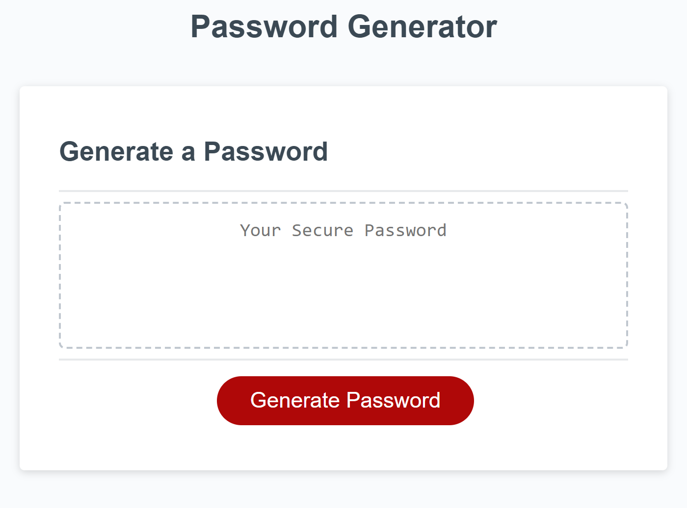

# module3javascriptchallenge
# JavaScript Challenge: Password Generator

This week's challenge was to modify the starter code to create an application that allows employees to generate random passwords based on the criteria  that they have selected. 

## Some of the criteria that had to be met included:
- User is presented with series of prompts for password criteria which included : choosing length of password (no less than 8 characters and no more than 128 characters), if they wanted lowercase or uppercase letters, and if they wanted numbers or special characters
- User has to select at lease one character type
- Password that is generated matched the selected criteria

## Mock up:

## Deployed Link:

https://thivsiv28.github.io/module3javascriptchallenge/

